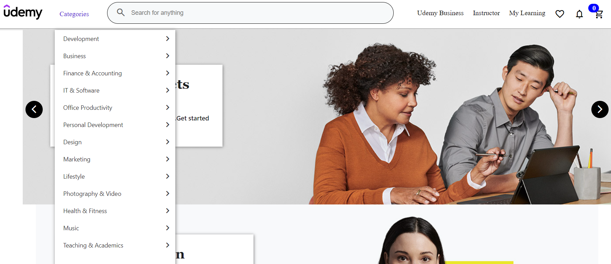
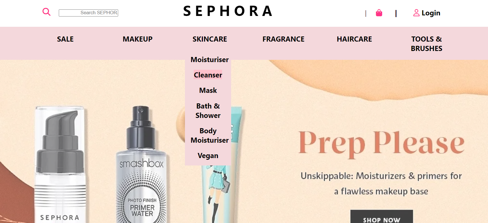

<h1 align="center">Hi 👋, I'm Md Ramiz Raja</h1>
<h3 align="center">Analytical and detail-oriented aspiring Full Stack Developer, capable of writing production ready code. Collaborative, team player who is proficient in working with interdisciplinary team and executing goal oriented projects.</h3>

  

  

- 🔭 I’m currently working on **Frank-Body-Clone**

- 🌱 I’m currently learning **ReactJs, Redux, NodeJs, Express, MongoDB**

- 👨‍💻 All of my projects are available at [https://raja00912.github.io/Portfolio/](https://raja00912.github.io/Portfolio/)

- 💬 Ask me about **React, JavaScript**

- 📫 How to reach me **mdramiz025@gmail.com**

- 📄 Know about my experiences [https://drive.google.com/file/d/1M7u3m2t8myOggDsJCK6KYnNY6agsNpmC/view?usp=sharing](https://drive.google.com/file/d/1M7u3m2t8myOggDsJCK6KYnNY6agsNpmC/view?usp=sharing)

<h3 align="left">Connect with me:</h3>

<h3 align="left">Languages and Tools:</h3>

               

<h2> My Projects :-</h2>
<h3>Udemy Clone &nbsp;<a  style="text-align:center;" href="https://joyful-cendol-eadc85.netlify.app/">Live </a></h3>

<h3>Ajio Clone &nbsp;<a  style="text-align:center;" href="https://lighthearted-sopapillas-be11cd.netlify.app/">Live </a></h3>

<h3>Sephora Clone &nbsp;<a  style="text-align:center;" href="https://stellar-salamander-9ec7e5.netlify.app/">Live </a></h3>

 
 

&nbsp;

